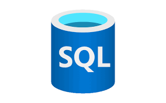
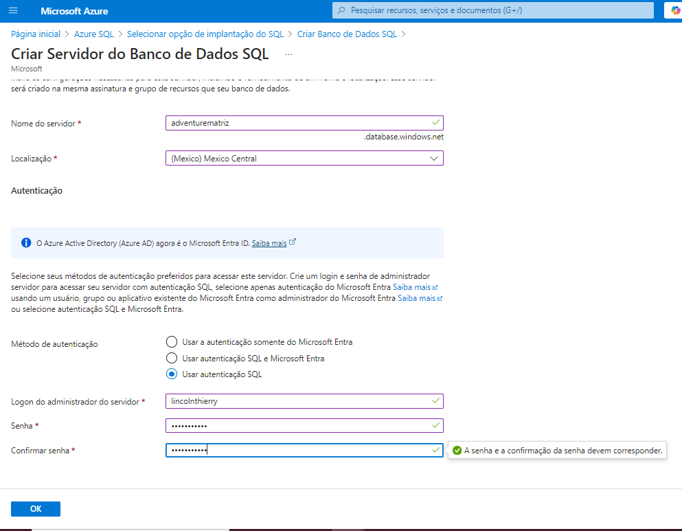

<h1>
    
    Configurando Servidor SQL no Azure 
  <h3>Projeto Azure SQL com Sample de data AdventureWorks</h3>
  <h3>Configurando Servidor SQL no Azure e realizando análise de descritiva</h3>
  

  
</h1>

## Introdução
Este projeto visa configurar um servidor SQL no Azure utilizando o dataset AdventureWorks. Abaixo, estão os passos detalhados da configuração e as consultas realizadas.

## 1. Criação do Servidor SQL

### Passos para Criar o Servidor SQL
1. Acesse o portal do Azure.
2. No painel, clique em "Criar um recurso".
3. Selecione "Banco de Dados" e, em seguida, "SQL Database".
4. Preencha as informações necessárias, como nome do banco de dados e plano de serviço.
5. Crie um novo servidor ou utilize um existente.

## 2. Configurações de Rede

### Detalhes da Configuração de Rede
1. Acesse a seção de "Configurações de Rede" no portal do Azure.
2. Verifique as configurações de firewall para permitir conexões.
3. Adicione endereços IP permitidos, se necessário.

## 3. Zona de Redundância Desabilitada - Motivos

### Motivos para Desabilitar a Zona de Redundância
- **Custo**: A manutenção de múltiplas zonas pode aumentar significativamente os custos.
- **Simplicidade**: Manter a configuração simples para facilitar a gestão e a recuperação de dados.
- **Necessidades do Projeto**: O projeto não requer alta disponibilidade em múltiplas zonas.

## 4. Editor de Consultas - Login

### Realizando o Login no Editor de Consultas
1. Acesse o SQL Server no Azure.
2. Utilize o Editor de Consultas para realizar login no banco de dados.

## 5. Análise Descritiva
Aqui temos que os 5 items que geram mais receitas são:

| ProductName                  | TotalQuantity | TotalRevenue     |
|------------------------------|---------------|-------------------|
| Road-350-W Yellow, 48       | 252           | 231674,8380       |
| Touring-1000 Blue, 60       | 156           | 223148,9520       |
| Mountain-200 Black, 42      | 162           | 223073,0280       |
| Mountain-200 Black, 38      | 156           | 214811,0640       |
| Touring-1000 Yellow, 60     | 102           | 142472,0232       |

Aqui temos os top 5 clientes que mais gastam:

| FirstName | LastName          | TotalOrders | TotalSpent      |
|-----------|-------------------|-------------|------------------|
| Terry     | Eminhizer         | 1           | 119960,8240      |
| Krishna   | Sunkammurali      | 1           | 108597,9536      |
| Christopher| Beck             | 1           | 98138,2131       |
| Kevin     | Liu               | 1           | 92663,5609       |
| Jon       | Grande            | 1           | 86222,8072       |

O total vendido do ano: 

| Year | TotalSales     |
|------|-----------------|
| 2008 | 956303,5949     |

## 6. Consultas Realizadas em SQL

<h3>Caminho para as Querys em SQL</h3>
<h4><a href= "sample_query/clientes_mais_compram.txt" align="left" alt="Azure_SQL_QUERY">Consulta: Quais são nossos clientes que mais compram ?</h4>
<h4><a href= "sample_query/receita.txt" align="left" alt="Azure_SQL_QUERY_0">Consulta: Qual é nossa Receita bruta</h4> 
<h4><a href= "sample_query/total_vendas_ano.txt" align="left" alt="Azure_SQL_QUERY_0">Consulta: Qual é nosso total de vendas do ano?</h4>  

## 7. Arquivos CSV para gerados. 

<h3>Caminho para os valores separados por vírgula (CSV)</h3>
<h4><a href= "csv/clientes_mais_compram.csv" align="left" alt="CSV_0">CSV: Quais são nossos clientes que mais compram ?</h4>
<h4><a href= "csv/receita.csv" align="left" alt="CSV_1">CSV: Qual é nossa Receita bruta</h4> 
<h4><a href= "csv/total-vendido-ano.csv" align="left" alt="CSV_2">CSV: Qual é nosso total de vendas do ano?</h4>  
